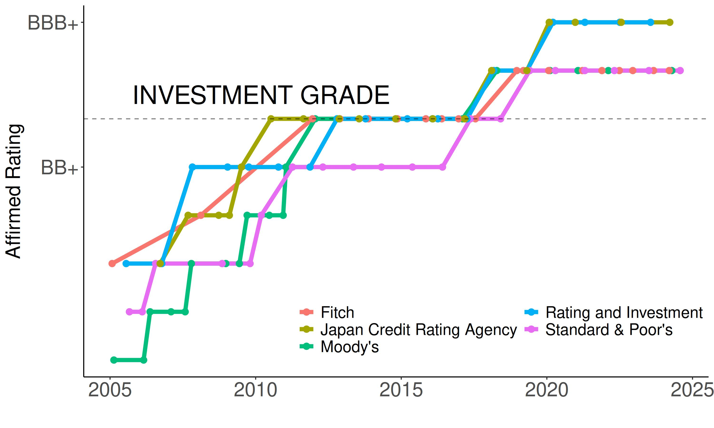

### ABOUT

This repo contains maintained data of sovereign credit rating of Republic of Indonesia. It is regularly updated as soon as Credit Rating Agency release their Rating Action on Indonesia.

Currently, the Republic receives solicited rating from 5 Agencies: Standard & Poors, Moodys, Fitch, Rating and Investment (R&I), as well as Japan Credit Rating Agency (JCRA). Rating assessment of each agency is conducted annually that producing Rating Action report released a moment after the assessment. The report would be complemented with several changes for outlook during the year.

-   Fullset data (1994-current) can be found in [rating_tidy.xlsx](https://github.com/vegatroz/rating_goi/blob/master/rating_tidy.xlsx)

-   R script to produce historical rating chart is available in [Qmd](https://github.com/vegatroz/rating_goi/blob/master/rating.qmd)
